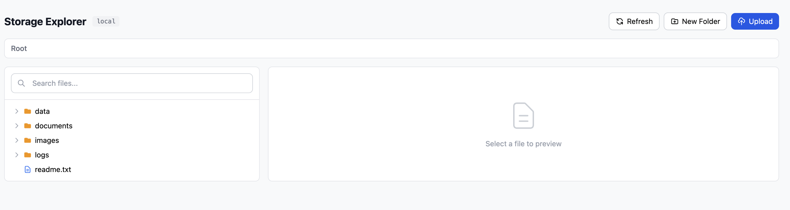
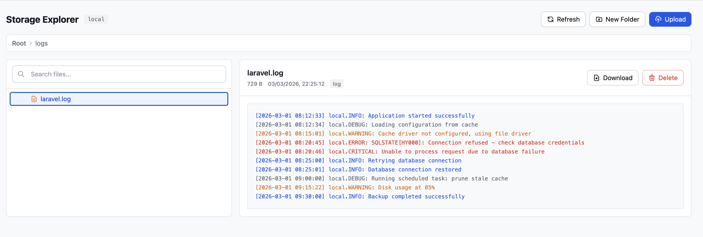
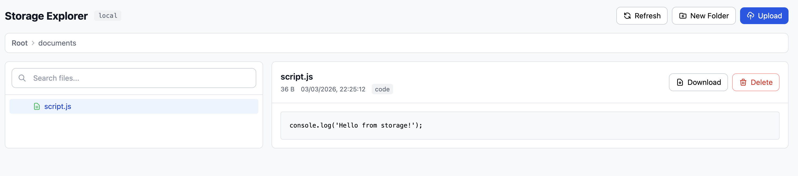
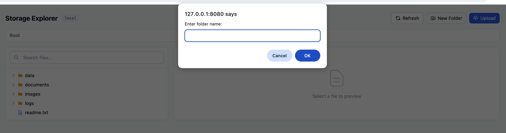
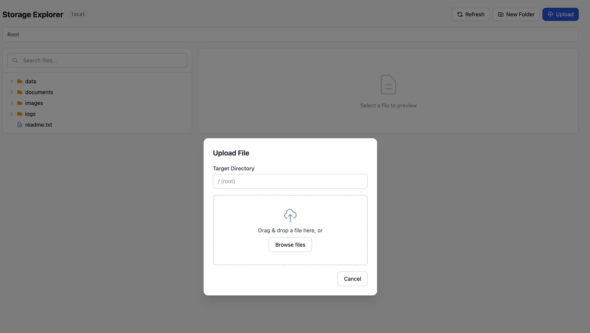

# Laravel Storage Explorer

[](https://packagist.org/packages/jakovic/laravel-storage-explorer)
[](https://packagist.org/packages/jakovic/laravel-storage-explorer)
[](https://github.com/jakovic/laravel-storage-explorer/blob/main/LICENSE)

A visual file manager for Laravel storage. Browse directories, preview files, upload, download, and delete - all from a clean, responsive UI. Built with Blade + Alpine.js, zero external dependencies.

## Screenshots











## Features

- **Directory tree** with lazy-loading and expand/collapse
- **File preview** for text, code, JSON, CSV, images, and log files with color-coded severity levels
- **Tail preview** for large files (shows last 64KB instead of failing)
- **File upload** with drag & drop and progress bar
- **Create folders** directly from the UI
- **File download** via signed URLs (5-minute expiry)
- **File and directory deletion** with confirmation
- **Search** across all files recursively
- **Two modes**: standalone page or embedded in your existing admin panel
- **Configurable**: disk, middleware, hidden patterns, blocked extensions, depth limits
- **Secure**: path traversal prevention, blocked dangerous uploads, signed downloads, CSRF protection
- **Zero dependencies** beyond Laravel itself (no Livewire, no npm build step)

## Requirements

- PHP 8.1+
- Laravel 10, 11, or 12

## Installation

```bash
composer require jakovic/laravel-storage-explorer
```

The package auto-registers via Laravel's package discovery. No additional setup required.

## Quick Start

Visit `/storage-explorer` in your browser. Done.

## Configuration

Publish the config to customize behavior:

```bash
php artisan vendor:publish --tag=storage-explorer-config
```

### All Options

```php
return [
    // Which filesystem disk to browse (must exist in config/filesystems.php)
    'disk' => 'local',

    // Subdirectory within the disk to use as root (empty = disk root)
    'root_path' => '',

    // Standalone route settings
    'standalone' => [
        'enabled' => true,
        'prefix' => 'storage-explorer',
        'middleware' => ['web'],
    ],

    // Embedded mode: render inside your app's layout
    'layout' => null,               // e.g. 'layouts.admin'
    'content_section' => 'content', // @section name in your layout
    'page_title' => 'Storage Explorer',

    // Files hidden from the tree view
    'hidden_patterns' => ['.gitignore', '.gitkeep', '.DS_Store'],

    // File preview settings
    'preview' => [
        'max_size' => 2 * 1024 * 1024,  // 2 MB (full preview limit)
        'tail_size' => 64 * 1024,        // 64 KB (tail preview for large files)
        'max_lines' => 1000,
        'text_extensions' => ['txt', 'log', 'md', 'csv', 'json', 'xml', 'yml', ...],
        'image_extensions' => ['jpg', 'jpeg', 'png', 'gif', 'svg', 'webp', ...],
        'code_extensions' => ['php', 'js', 'ts', 'css', 'py', 'go', 'rs', ...],
    ],

    // Upload settings
    'upload' => [
        'enabled' => true,
        'max_size' => 10240, // KB
        'blocked_extensions' => ['php', 'phar', 'sh', 'exe', 'bat', 'cmd', 'com', 'msi'],
    ],

    // Delete settings
    'delete' => [
        'enabled' => true,
        'allow_directory_delete' => false,
    ],

    // Tree display
    'tree' => [
        'lazy_load' => true,
        'max_depth' => 20,
        'max_items_per_directory' => 500,
    ],
];
```

## Protecting with Middleware

Add authentication middleware in the config:

```php
'standalone' => [
    'middleware' => ['web', 'auth'],
],
```

Or use a gate for fine-grained access:

```php
'standalone' => [
    'middleware' => ['web', 'auth', 'can:access-storage-explorer'],
],
```

## Embedding in Your Admin Panel

### Option 1: Config-based (recommended)

Set your layout in `config/storage-explorer.php`:

```php
'layout' => 'layouts.admin',          // your existing layout
'content_section' => 'content-page',  // @yield() section name in your layout
'page_title' => 'Storage Explorer',
```

The package renders inside your layout with fully scoped CSS - no Tailwind CDN needed, no conflicts with Bootstrap or other frameworks.

### Option 2: Manual include

In your Blade view:

```blade
{{-- In <head> --}}
@include('storage-explorer::partials.assets')
<meta name="csrf-token" content="{{ csrf_token() }}">

{{-- In body --}}
@include('storage-explorer::explorer', [
    'deleteEnabled' => true,
    'uploadEnabled' => true,
    'apiBase' => url('storage-explorer'),
])
```

**Important**: Keep `standalone.enabled = true` so the API routes are registered.

### Option 3: Custom routes

Register routes manually in your `routes/web.php` with your own middleware:

```php
use Jakovic\StorageExplorer\StorageExplorer;

Route::middleware(['web', 'auth', 'admin'])->group(function () {
    StorageExplorer::routes('admin/storage');
});
```

Then set `standalone.enabled = false` in config to avoid duplicate routes.

## Browsing Different Disks

By default the package browses the `local` disk. To browse other disks:

```php
// Browse the public disk
'disk' => 'public',

// Browse S3 (read-only operations work, upload/delete depend on permissions)
'disk' => 's3',

// Browse a subdirectory only
'disk' => 'local',
'root_path' => 'uploads/documents',
```

## Publishing Views

Customize the UI by publishing views:

```bash
php artisan vendor:publish --tag=storage-explorer-views
```

Views are published to `resources/views/vendor/storage-explorer/`.

## Security

The package includes multiple security layers:

- **Path traversal prevention** - rejects `..`, null bytes, URL-encoded traversal attempts
- **Signed download URLs** - 5-minute expiry, prevents unauthorized direct file access
- **Blocked upload extensions** - PHP, shell scripts, executables blocked by default
- **Configurable middleware** - add `auth`, gates, or custom middleware
- **CSRF protection** - all write operations require CSRF token
- **HTML escaping** - log file preview escapes content before highlighting

**Important**: The default configuration has no authentication. Always add auth middleware in production.

## Testing

```bash
vendor/bin/phpunit
```

The test suite covers:
- Unit tests for `StorageService` (path validation, directory listing, search, file operations)
- Unit tests for `FileType` enum
- Feature tests for all API endpoints (tree, preview, search, upload, download, delete)
- Security tests (path traversal vectors, blocked extensions, signed URLs)

## Contributing

Contributions are welcome! Please open an issue or submit a pull request.

## License

MIT License. See [LICENSE](LICENSE) for details.

## Author

**Simo Jakovic** - [jakovic.com](https://jakovic.com) - [GitHub](https://github.com/jakovic)
